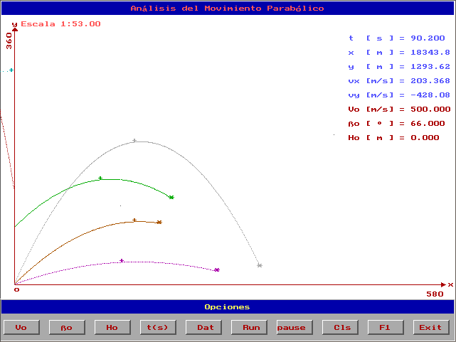

# KINEM
*KINEM.EXE is a MS-DOS program, written in C programming language back in 2002, designed to study the parabolic motion of physical bodies. KINEM stands for KINEMATICS. The main purpose of KINEM.EXE is to make studying of the parabolic motion easy, intuitive, and even a bit fun.*

## Table of contents

- [Kinematics and Parabolic Movement](./docs/parabolic-motion.md)
- [Fundamental concepts of Kinematics & Dynamics (in Spanish)](./docs/fundamentals-es.md)
- [Running KINEM.EXE using DOSBOX Emulator](./docs/running-kinem.md)
- [KINEM.HLP the original help-document for KINEM.EXE](./docs/kinem-help.md)

## KINEM overview

### What is KINEM.EXE?
At its core, KINEM.EXE helps you analyze the motion of objects launched at an angle under gravity, a concept known as projectile motion. By entering key parameters like:

- Initial velocity (V₀)
- Launch angle (θ₀)
- Initial height (H₀)

The program calculates the motion and provides a graphical representation of the trajectory.

### Why KINEM.EXE?
- Graphical & Intuitive: KINEM features a simple, visually engaging graphical interface, making it user-friendly despite being a DOS application.
- Dynamic Simulations: Launch projectiles, pause, adjust parameters, and instantly see the effects on the motion.
- Educational Focus: This program demystifies the math behind parabolic motion, helping you visually understamnd this matter of kinematics.

Whether you’re revisiting DOS programs for nostalgia or diving into physics concepts for the first time, KINEM.EXE is a fun and educational tool to explore the parabolic motion. Give it a try and see how projectiles come to life on your screen!

___

