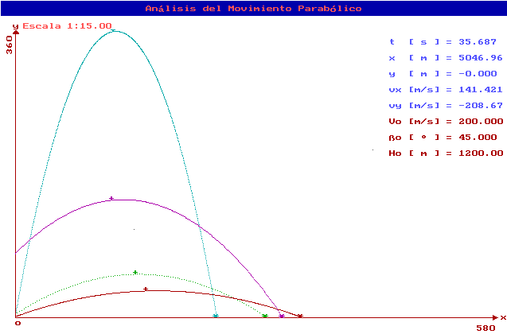

## Parabolic Motion

**Parabolic motion** or **projectile motion** refers to the two-dimensional motion of an object under the influence of gravity ($g$), following a curved trajectory known as a parabola. This type of motion occurs when an object is launched at an angle to the horizontal with an initial velocity. The motion can be analyzed using the principles of kinematics.

### Key Assumptions
1. Air resistance is negligible.
2. The acceleration due to gravity $g$ acts toward the center of the Earth and remains constant.
3. The motion can be decomposed into two independent components:
   - Horizontal motion (constant velocity).
   - Vertical motion (uniform acceleration due to gravity).

### Initial Conditions
Initial Velocity (v₀): The magnitude of the velocity at launch.
Launch Angle (θ₀): The angle between the velocity vector and the horizontal axis.

## Equations of Parabolic Motion

### 1. Horizontal Motion

The horizontal displacement $x(t)$ at time $t$ is:

$$
x(t) = v_0 \cdot \cos(\theta_0) \cdot t
$$

### 2. Vertical Motion

The vertical displacement  $y(t)$ at time $t$ is

$$
y(t) = v_0 \cdot \sin(\theta_0) \cdot t - \frac{1}{2} \cdot g \cdot t^2
$$

### 3. Time of Flight
The total time the projectile is in the air (time of flight) is:

$$
T = \frac{2 \cdot v_0 \cdot \sin(\theta_0)}{g}
$$

### 4. Maximum Height
The maximum height the projectile reaches is:

$$
H = \frac{v_0^2 \cdot \sin^2(\theta_0)}{2 \cdot g}
$$

### 5. Range of the Projectile
The horizontal range, or the total distance traveled along the horizontal axis, is:

$$
R = \frac{v_0^2 \cdot \sin(2 \cdot \theta_0)}{g}
$$

### 6. Parabolic Trajectory
The equation for the trajectory of the motion, $y(x)$, is:

$$
y(x) = x \cdot \tan(\theta_0) - \frac{g \cdot x^2}{2 \cdot v_0^2 \cdot \cos^2(\theta_0)}
$$

These equations describe the motion of a projectile in a gravitational field. By controlling the initial conditions v₀ and θ₀; the time of flight, maximum height, and range can be predicted. Parabolic motion is an essential matter in physics and engineering.

___

